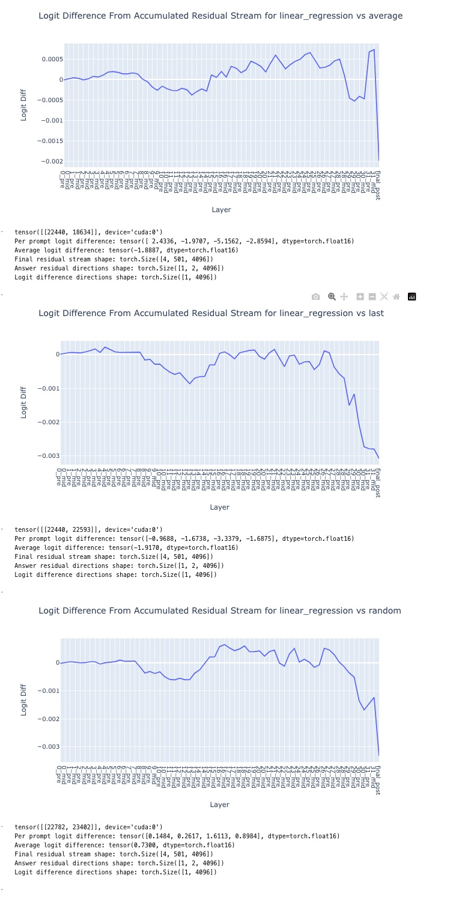

# From words to numbers
## setup
```
mkdir .models
git clone git@hf.co:meta-llama/Llama-3.1-8B-Instruct
```

## Notes
Interesting heads:
layer 9 head 30
layer 13 head 22

Linear Regression vs ...
from `llama3.1-linreg-logit-diff.ipynb` commit 2257aae5c071ce02aa2ca7c26b1ce1609db08ebc
